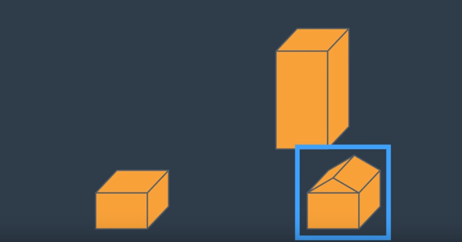
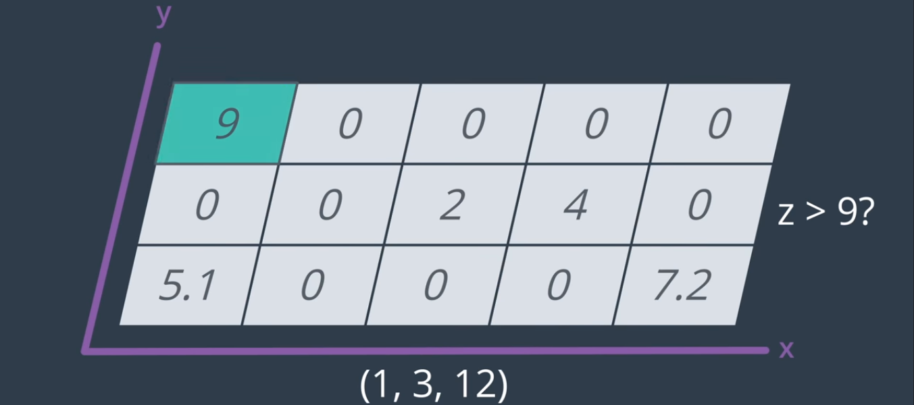

# AAE_Notebook_012_RandomSampling
In this notebook, we look into the concept of random sampling and how its implementation is effected by our 2.5D obstacle map.

Our obstacle file (colliders.csv) is in 2.5d. That is, it is given in such a way that the feasibility of a cell is given as would be assumed, however, the height of the obstacle is not actually mapped; instead, we are given the height of the obstacle as a parameter of the cell.

We've, previously, looked at graph-based medial axis transform representation of our environment. This approach required us to, yet, build a grid-based representation of the environment. When moving into a three dimensional state space, constructing a 3D grid, such as a voxel map, becomes quite computationally expensive. Instead, let us consider random sampling.

Per the name, random sampling is just that, taking random samples throughout the state space and evaluating them for feasibility. 

One thing that we must keep in mind when randomly sampling points within our state space is the aforementioned 2.5D nature of our obstacle mappings. That is to say, assuming a 2.5D grid of our environment at which one of our points lie at (2,4) with a height of 10 meters, we must cross-check feasibility of that point as a viable path by not only checking to see if cell (2,4) is an obstacle or free space but, also, the height of the given obstacle in comparison to the height of the point.

As shown in the picture, our randomly selected point (1,3,12) does, in fact, lie in a cell with an obstacle; thus, we must now compare the given height of the obstacle with that of the point. The given height, as expressed by our 2.5D grid, is 9. The height at which our point was sampled is 12. So, even though the point is within an occupied cell, it is above the height of the obstacle and, therefor, in free space.
